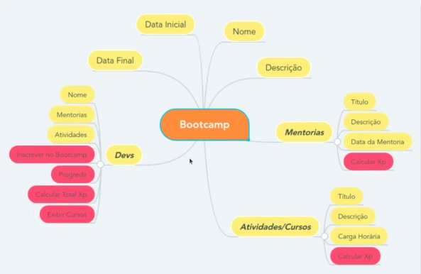

## 
 DESAFIO: Abstraindo um sistema de bootcamp em Java 
      

### Simulando um sistema básico de um bootcamp para devs atribuindo conceitos de programação orientada a objetos. 

### Conteúdos abordados  
   
* Abstração
* Encapsulamento
* Herança
* Polimorfismo

## 
